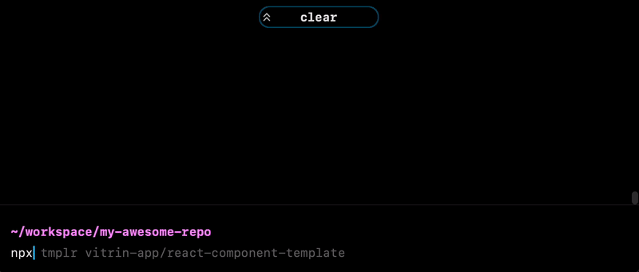

# Template Repo Example for [`tmplr`](https://github.com/loreanvictor/tmplr)

This is an example template repository using [`tmplr`](https://github.com/loreanvictor/tmplr) for templating.

👉 If you click on [**Use this template**](https://github.com/loreanvictor/tmplr-template-example/generate) button above, it will automatically apply the template recipe and create an apt README for you.

👉 If you create an empty repo, you can still apply this template on it using the following command:
```bash
npx tmplr loreanvictor/tmplr-template-example
```

👉 If you want, you can also use this repository on a normal (not git controlled) folder using the same command.
  In that case, it will ask a few questions from you to fill out the details:


<br><br>

## How does it work?

The templating recipe can be found in [`.tmplr.yml`](.tmplr.yml). The recipe specifies how to resolve values
required for templating (like name of the owner of the repo, their email, name of the project, etc.) based on the
execution context: if it finds the appropriate environment variables (for example, set by the CI or GitHub Action workflows),
it will use them, otherwise it will try to read local data (git information, name of current folder, etc.), and if none
are available, it will prompt the user.

There is also an [initialization workflow](.github/workflows/init.yml) that runs when the template is used (basically the first
push), executes the recipe using [`tmplr`](https://github.com/loreanvictor/tmplr) and then removes all templating artifacts, to
ensure that templating workflow is only executed once.

For more information, you can checkout [the template README](README.tmpl.md), which will be filled up and used when the template
recipe is executed, or checkout [`tmplr`'s docs](https://github.com/loreanvictor/tmplr) for more information.

<br><br>


